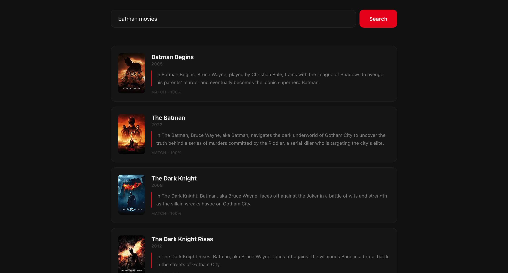
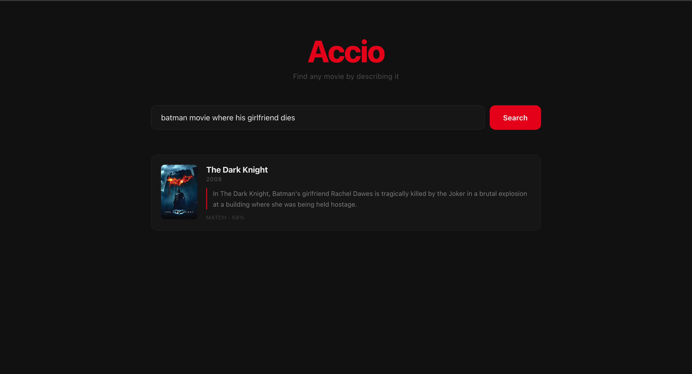

# Accio

Find any movie by describing it - scene, character, actor, mood, location.

A multi source RAG pipeline with LangGraph orchestration, dual vector retrieval, and cross encoder reranking.




## How It Works

Natural language query → **LLM signal extraction** → **multi-source retrieval** → **semantic reranking** → results with AI-generated explanations.

1. **Intent parsing** - Groq LLM extracts structured signals from the query: actors, directors, characters, genres, year range, scene text, theme text
2. **Pre-filtering** - TMDB API narrows the candidate pool by actor/director filmography; local genre cache filters by genre 
3. **Dual retrieval** - Qdrant vector search over subtitle chunks + synopsis embeddings in parallel
4. **Chunk aggregation** - scores aggregated per movie with a strong signal boost formula; adaptive gap filtering cuts noise
5. **Cross-encoder reranking** - fires only when top cosine scores are too close to call (within 0.005); uses `ms-marco-MiniLM-L-6-v2`
6. **Generation** - Groq LLM writes a one sentence explanation of why each result matches

## Tech Stack

| Layer | Tech |
|---|---|
| Orchestration | LangGraph (4-node state machine: parse → filter → search → finalize) |
| Vector DB | Qdrant (cosine similarity over subtitles + synopses) |
| Embeddings | `sentence-transformers/all-MiniLM-L6-v2` |
| Reranker | `cross-encoder/ms-marco-MiniLM-L-6-v2` |
| LLM | Groq (Llama 3) — intent parsing + explanation generation |
| Metadata | TMDB API — actor/director IDs, genre cache |
| Backend | FastAPI |
| Frontend | React + Vite |

## Run

```bash
python run.py
```

## Setup (First Time Only)

1. **Backend**
```bash
cd backend
python -m venv venv
source venv/bin/activate
pip install -r requirements.txt
```

2. **Frontend**
```bash
cd frontend
npm install
```

3. **Database**
```bash
docker-compose up
```

4. **Genre cache** (one-time, avoids per-query TMDB calls)
```bash
python -m Scripts.build_genre_cache
```

5. **Keys** — copy `.env.example` files and fill in your API keys
